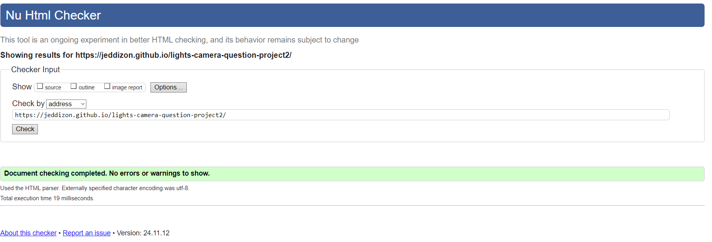
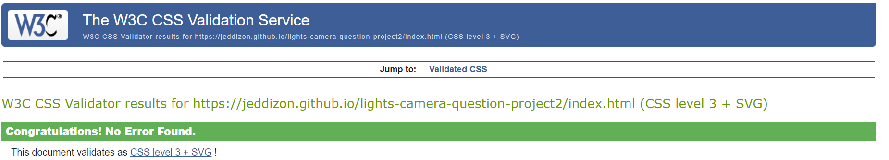
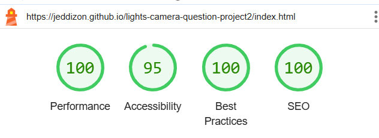

# Lights, Camera, Question! (Movies Quiz)

Welcome to <em> Lights, Camera, Question! </em>, the ultimate destination for film lovers of all kinds! Dive into a world of movie trivia, where you can test your knowledge on everything from Hollywood classics to modern blockbusters, animated adventures to spine-tingling horror, and everything in between. Whether you’re a casual moviegoer or a true film buff, our quizzes offer fun and challenging questions across every genre and era. With regularly updated quizzes and interactive features, <em> Lights, Camera, Question! </em> is here to make movie trivia as entertaining as the movies themselves.

### Live link:

 Lights, Camera, Question! < (https://jeddizon.github.io/lights-camera-question-project2/) >

---

## Features

**Mobile-Responsive**: Optimised for both desktop and mobile devices.

**Quiz genres**: 6 genres of film to choose from to test your film knowledge.

**Randomized** questions and answers for variety.

**Score tracking** and end-game results.

Clean and intuitive **interface**.

**Footer social media** for ways to get in contact with us.

---

### Future Features

See below any additional features that I would like to implement:

---

## Design

### Colour Scheme

#### Main theme

The chosen color palette reflects a dynamic and engaging user experience:

  - #FF5F00 (Bright Orange): Evokes excitement and energy, capturing the thrill of movie quizzes.
  - #B20600 (Deep Red): Adds intensity and passion, symbolizing cinematic drama.
  - #00092C (Midnight Blue): Provides a sleek, cinematic backdrop, reminiscent of a theater's ambiance.
  - #EEEEEE (Light Gray): Balances the bold colors with clarity and simplicity for easy readability.

#### Action / adventure genre

The color palette for the action-adventure movie genre quiz conveys energy, exploration, and excitement:

  - #124076 (Deep Blue): Symbolizes depth and mystery, aligning with the adventurous spirit.
  - #7F9F80 (Muted Green): Reflects nature and resilience, key elements of action-packed escapades.
  - #F9E897 (Soft Yellow): Brings warmth and a sense of discovery, echoing the thrill of adventure.
  - #FFC374 (Vibrant Orange): Adds a punch of excitement and high energy, capturing the action-driven vibe.

#### Animation genre

The color palette for the animation genre quiz exudes creativity, imagination, and wonder:

  - #27005D (Deep Purple): Represents magic and fantasy, core themes in animation.
  - #9400FF (Vivid Violet): Adds vibrancy and playfulness, capturing the whimsy of animated worlds.
  - #AED2FF (Soft Blue): Evokes a sense of wonder and lightheartedness, appealing to all ages.
  - #E4F1FF (Lightest Blue): Provides a gentle, airy feel, ensuring a delightful and approachable interface.

#### Romance genre

The color palette for the romance genre quiz embodies passion, tenderness, and warmth:

  - #E72929 (Rich Red): Symbolizes love and intensity, the essence of romance.
  - #FF5BAE (Bright Pink): Adds a playful and affectionate touch, reflecting romantic emotions.
  - #FFE4CF (Soft Peach): Conveys warmth and intimacy, creating a welcoming atmosphere.
  - #FFFDD7 (Light Cream): Offers a gentle, dreamy background, enhancing the romantic mood.

#### Classics genre

The color palette for classical movies reflects elegance, nostalgia, and timeless sophistication:

  - #EDDFE0 (Soft Rose): Evokes a sense of vintage charm and subtle beauty.
  - #F5F5F7 (Light Gray): Adds a clean and understated elegance, reminiscent of classic film reels.
  - #B7B7B7 (Muted Silver): Symbolizes the glamour and prestige of the golden age of cinema.
  - #705C53 (Warm Brown): Grounds the palette with a touch of antiquity, echoing the sepia tones of old films.

#### Horror genre

The color palette for the horror genre quiz conveys fear, suspense, and unease:

  - #0F0F0F (Pitch Black): Represents darkness and the unknown, essential elements of horror.
  - #232D3F (Dark Gray-Blue): Adds a cold, eerie tone, enhancing the atmosphere of dread.
  - #005B41 (Deep Green): Evokes a sense of decay and unease, aligning with horror's unsettling themes.
  - #008170 (Murky Teal): Introduces a chilling, unnatural vibrancy, heightening tension and fear.

#### Comedy genre

The color palette for the comedy genre quiz radiates joy, energy, and playfulness:

  - #FFF100 (Bright Yellow): Symbolizes happiness and laughter, the heart of comedy.
  - #006BFF (Bold Blue): Adds a lively and energetic contrast, reflecting dynamic humor.
  - #08C2FF (Vivid Cyan): Brings a refreshing and fun vibe, echoing lighthearted moments.
  - #BCF2F6 (Soft Aqua): Provides a breezy, cheerful touch, creating an inviting and whimsical atmosphere.

---

## Technologies Used

- HTML: used to create the basis of the website.
- CSS: used to style and edit the layout of the website.
- Balsamiq: used to create wireframes of what the website was envisioned to look like.
- Git: used for version control.
- Github: used to host the website.
- JavaScript: used to create the quiz functionaility, score updator, checking for correct answer.

---

## Testing

### Manual Testing

Below are the details of manual tests conducted to ensure functionality:

| TEST                   | ACTION                                | EXPECTATION                              | RESULT    |
|------------------------|---------------------------------------|------------------------------------------|-----------|
| **Page title goes to Home page**   | User clicks on the **Lights, Camera, Question!** link | **Home page** opens           | **SUCCESS** |
| **Home Link**          | User clicks on the **Home** link      | The **home** page opens                   | **SUCCESS** |
| **Action / adventure quiz Link**   | User clicks on the **Click here to start!** link | The **Action / adventure** quiz opens            | **SUCCESS** |
| **Animation quiz Link**   | User clicks on the **Click here to start!** link | The **Animation** quiz opens            | **SUCCESS** |
| **Romance quiz Link**   | User clicks on the **Click here to start!** link | The **Romance** quiz opens            | **SUCCESS** |
| **Classics quiz Link**   | User clicks on the **Click here to start!** link | The **Classics** quiz opens            | **SUCCESS** |
| **Horror quiz Link**   | User clicks on the **Click here to start!** link | The **Horror** quiz opens            | **SUCCESS** |
| **Comedy quiz Link**   | User clicks on the **Click here to start!** link | The **Comedy** quiz opens            | **SUCCESS** |
| **Twitter / X link**   | User clicks on **Twitter / X logo** link | The **website** quiz opens in another tab         | **SUCCESS** |
| **Youtube link**   | User clicks on **Youtube logo** link | The **website** quiz opens in another tab         | **SUCCESS** |
| **Facebook link**   | User clicks on **Facebook logo** link | The **website** quiz opens in another tab         | **SUCCESS** |
| **Instagram link**   | User clicks on **Instagram logo** link | The **website** quiz opens in another tab         | **SUCCESS** |
| **Answer buttons**   | User clicks on an **answer button** | Changes color to green or red depending if correct or incorrect answer        | **SUCCESS** |
| **Answer buttons** permanent  | User clicks on an **answer button** | Cannot change answer once the user finds out that the answer they chose is correct or incorrect        | **SUCCESS** |
| **Next button**  | User clicks on **next button** | Alerts user to choose an answer before next question loads       | **SUCCESS** |
| **Pass or fail results**  | User finishes a quiz | Comemnt at the end to state if they passed or failed, what percentage and score they recieved      | **SUCCESS** |
| **Return to Home button** appearance  | User finishes a quiz | Button to bring user back to home appears at the end      | **SUCCESS** |
| **Return to Home button**  | User clicks **Click here to return to Homepage** button | Button brings user back to homepage    | **SUCCESS** |
| **Genre specific themes**  | User clicks on any genre quiz | Quiz loads up with relevant color palette     | **SUCCESS** |

### W3C HTML Validation

Link to validator results: < https://validator.w3.org/nu/?doc=https%3A%2F%2Fjeddizon.github.io%2Flights-camera-question-project2%2F >

### W3C CSS Validation

### Lighthouse testing

### JSHint

---

## Responsiveness

### Different device screens

---

## Bugs 

See below the main bugs I found throughout the development process:

  - Can't get all buttons to start the game with the class of "genre-btn".
    - FIX: Had startGame(this) instead of startGame(button).

  - Couldnt get next button to work.
    - FIX: Used devtools to check with console log that I have correct ids logged. Found I had duplicated the IDs; removed duplicate. Also wrapped entire script in domcontent loaded. 

  - Quiz answers kept showing up in position 1 (always at the same place).
    - FIX: Tried to at first manually move the position of the correct answers. Instead found that creating a function to randomise questions was a better idea. 

  - Found out that users can pick a different answer after notification of answer correct/incorrect.
    - FIX: Created a function to disable answer buttons from doing anything.

  - Users can skip to the end of the quiz without choosing an answer. 
    - FIX: Create event listener to ensure user chooses an snwer first before hitting next.

---

## Deployment
 
This project was deployed on Github. The site to deploy can be read below:

### Steps

**Instructions copied from CodeInstitute Instructions - The benefits of early deployment**

1. Go to the **Settings** tab of your GitHub repo.
2. On the left-hand sidebar, in the **Code and automation** section, select **Pages**.
3. Make sure:

    1. **Source** is set to 'Deploy from Branch'.
    2. **Main branch** is selected.
    3. **Folder** is set to / (root).

4. Under Branch, click **Save**.
5. Go back to the **Code** tab. Wait a few minutes for the build to finish and **refresh your repo**.
6. On the right-hand side, in the **Environments** section, click on 'github-pages'.
7. Click **View deployment** to see the live site. 

### Live link:

 Lights, Camera, Question! < https://jeddizon.github.io/lights-camera-question-project2/ >

### Installation

Steps to set up the project on a local machine:

  1. Clone the repository:

    git clone https://github.com/your-username/movie-quiz-game.git

  2. Open the index.html file in a browser to play.

---

## Credits 

### Content

- Informative Content
  - Quiz questions
    - Reader's Digest < https://www.rd.com/article/movie-trivia-facts/ >
    - Water Cooler Trivia < https://www.watercoolertrivia.com/trivia-questions/movie-trivia-questions >
    - Land of Trivia < https://landoftrivia.com/movie-trivia-questions/ >

- Extra help 
  - Chris Quin (Mentor)
	  - Feedback
	  - Tips, ideas, mindset on js flow

- Outside Code
  - Love running/Chieftain mbt code for dropdown, initial styling for logo, initial css for website.
  - Love Maths - for js
  - Stack Overflow
    - Update css with js < https://stackoverflow.com/questions/61802008/vue-js-how-can-i-access-and-change-css-root-variables-from-vue-component-to-to/61803134 >
  - Markdown Guide for README < https://www.markdownguide.org/cheat-sheet/ >
  - Youtube - Web Dev Simplified - quiz code structure and flow < https://www.youtube.com/watch?v=riDzcEQbX6k >
  - W3Schools
    - Update css root variable using js < https://www.w3schools.com/css/css3_variables_javascript.asp >
  - Observable hq 
    - Update css with js < https://observablehq.com/@triptych/how-to-change-the-value-of-css-variables-with-javascript-unt >

### Media 

- Icons: Font Awesome < https://fontawesome.com >
- Photos: 
- Colour palette combinations: 
  - Main color palette <  https://colorhunt.co/palette/ff5f00b2060000092ceeeeee >

